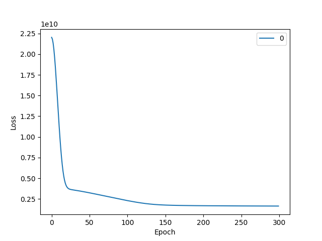
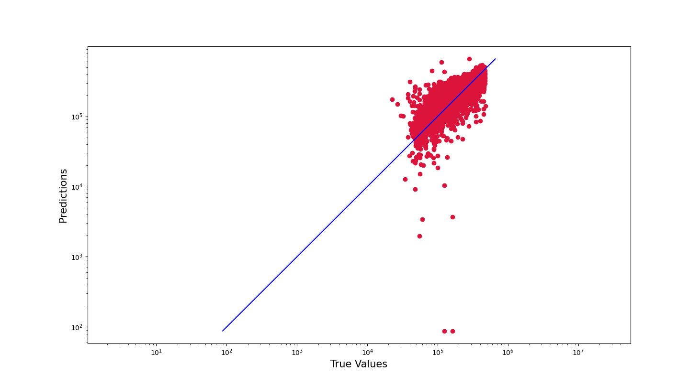

# Predicting House Prices using Neural Networks
The goal of this project is to use housing data and neural networks to predict the price of houses in California. This project differs from my STATA project of a similar title, in that this is a predictive, rather than interpretive, model. As noted in *Applied Predictive Modeling*, this means we are primarily concerned with outcome, rather than how the outcome is obtained. I will be using a neural network, and with that, comes a loss of interpretation. At the same time, a neural network offers more maleability and adaptability.

# Dataset
I found the dataset on Kaggle, under the title "California Housing Prices." The dataset originates in the 1990 California census. Although it can't be used to extrapolate information about current housing prices, it is a good excersice in predicting housing prices at the time.

# Analyzing the Dataset
The first step of any data science project is to understand the dataset. The first thing I did was use .head() visually see some entries in the data. After that, I checked for missing values. There were 207 missing entries for total_bedrooms, and so I dropped those entries (later, we will see that I drop the variable entirely because of collinearity with other variables). Finally, I converted the categorical variable "ocean_proximity" to an ordinal variable, with 0 representing the houses furthest from the ocean, and 4 represeting those on an island.

# Data Pre-Processing
After looking through the dataset, it was time to pre-process the data. From the data analysis code, I created a correlation matrix, VIF table, and distribution graph of each varaible. These are crucial in understanding how the data needed to be transformed before being put into a model.
Correlation Matrix:

Distributions:

VIF Table:

Based on the correaltion matrix, the variables total_bedrooms and total_rooms were higly correlated. We should remove one of them, and to determine which one, I looked to the VIF table. Since total_bedrooms had a higher VIF value, meaning it is highly correlated with all the variables, I decided to remove it.

Next, I decided to do some feature engineering. Since population and total_rooms were highly correlated, I first thought to remove one or the other. Then I realized it would make sence to combine them into one variable of rooms per person, since this could represent a supply of housing. Finally, I dropped total_rooms since it was now represented in rooms_per_person. I performed a similar method for households.

Finally, I wanted to remove the outliers and fix any distribution issues. Looking at the distributions, I removed any entries where the median age was above 50, houses were valued over 475,000, and houses on an island (since these are the few houses on Catalina, which can mess up our model later).

# Building the Network
As noted in the title, I used a neural network to build the model. Specifically, I used a regressor neural network, meaning the final layer consisted of one node with no activation function, allowing for a continuous range of outputs. I decided on using 1 hidden layer with 5 nodes, since it about the average of the input layer (8 nodes) and output layer (1 node). This gave consistant convergence, so I stuck with it. For more information on the network, such as learning rate, see the model.py file.

I used a 70/30 split of data into training and testing. I also used mim-max scaling on the data to assist with convergence of the model.

# Results
Using the graph of the loss function, the model appeared to converge after about 150 epochs. 

The model was able to achieve an MAE value of 48264. In terms of interpretting this result, this meant the model's prediction was, on average, about $48,264 off of the actual median house value.

To get a better understanding of the results, I graphed the pairs of predicted values and target values, seen here.

As you can see, there are a few outliers in which the model predicts their median value to be low, but the actual value is high.

